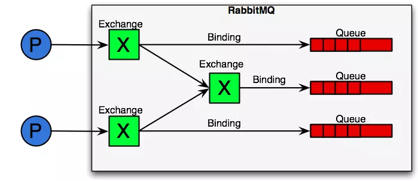
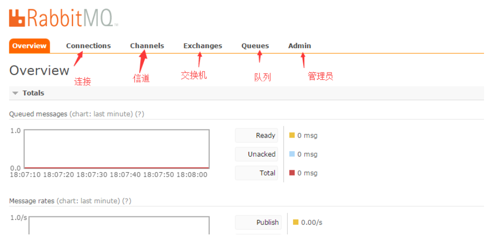
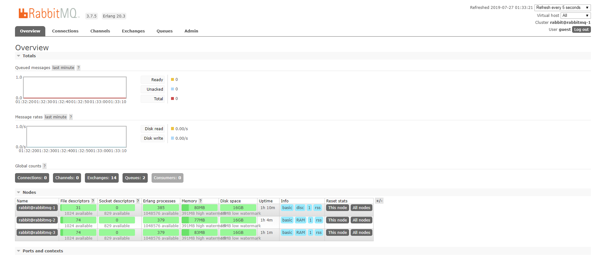
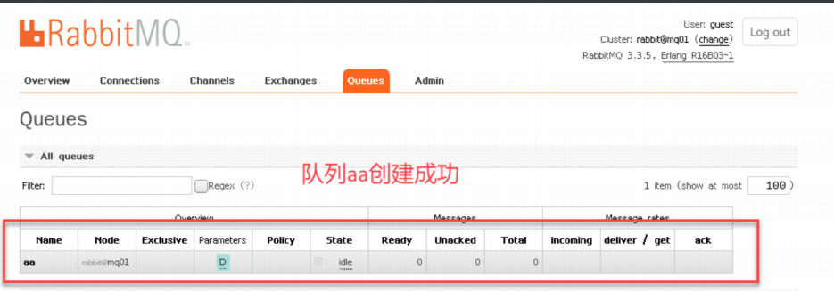

## RabbitMQ 消息中间件/消息队列


### 1、消息中间件

#### 1、简介


**消息中间件也可以称消息队列，是指用高效可靠的消息传递机制进行与平台无关的数据交流，并基于数据通信来进行分布式系统的集成。**通过提供消息传递和消息队列模型，可以在分布式环境下扩展进程的通信。


当下主流的消息中间件有RabbitMQ、Kafka、ActiveMQ、RocketMQ等

#### 2、作用


##### 1、消息中间件主要作用

- 冗余(存储)

- 扩展性

- 可恢复性

- 缓冲

- 异步通信

- 削峰  ：消息队列中的常用场景，一般在秒杀或抢购活动中使用广泛。一般会因为流量过大，应用系统配置承载不了这股瞬间流量，导致系统直接挂掉，即传说中的“宕机”现象。为解决这个问题，我们会将那股巨大的流量拒在系统的上层，即将其转移至 MQ 而不直接涌入我们的接口。

- 解耦（耦合性），降低应用与应用间的耦合性

##### 2、消息中间件的两种模式

###### 1、P2P模式  Rabbitmq


P2P模式包含三个角色：消息队列（Queue）、发送者(Sender)、接收者(Receiver)。每个消息都被发送到一个特定的队列，接收者从队列中获取消息。队列保留着消息，直到它们被消费或超时。


**P2P的特点：**（点对点：Queue，不可重复消费）

- 每个消息只有一个消费者（Consumer），即一旦被消费，消息就不再在消息队列中存在

- 发送者和接收者之间在时间上没有依赖性，也就是说当发送者发送了消息之后，不管接收者有没有正在运行它不会影响到消息被发送到队列

- 接收者在成功接收消息之后需向队列应答成功

- 如果希望发送的每个消息都会被成功处理的话，那么需要P2P模式


###### 2、Pub/Sub模式（发布/订阅：Topic，可以重复消费） Kafka


Pub/Sub模式包含三个角色：话题（Topic）、发布者（Publisher）、订阅者（Subscriber） 。多个发布者将消息发送到Topic，系统将这些消息传递给多个订阅者。


**Pub/Sub的特点：**


- 每个消息可以有多个消费者

- 发布者和订阅者之间有时间上的依赖性。针对某个主题（Topic）的订阅者，它必须创建一个订阅者之后，才能消费发布者的消息

- 为了消费消息，订阅者必须保持运行的状态

- 如果希望发送的消息可以不被做任何处理、或者只被一个消费者处理、或者可以被多个消费者处理的话，那么可以采用Pub/Sub模型


##### 3、常用中间件介绍与对比


###### 1、Kafka

Kafka是LinkedIn开源的分布式发布-订阅消息系统，目前归属于Apache顶级项目。Kafka主要特点是追求高吞吐量，一开始的目的就是用于日志收集和传输。0.8版本开始支持复制，**不支持事务，对消息的重复、丢失、错误没有严格要求，适合产生大量日志数据的互联网服务的数据收集业务。**


###### 2、RabbitMQ

RabbitMQ是使用Erlang语言开发的开源消息队列系统，**基于AMQP协议来实现。AMQP的主要特征是面向消息、队列、路由（包括点对点和发布/订阅）、可靠性、安全。AMQP协议更多用在企业系统内对数据一致性、稳定性和可靠性要求很高的场景，对性能和吞吐量的要求还在其次。**


Erlang是一种通用的面向并发的编程语言


###### 3、RocketMQ

RocketMQ是阿里开源的消息中间件，**它是纯Java开发，具有高吞吐量、高可用性、适合大规模分布式系统应用的特点。**它对消息的可靠传输及事务性做了优化，目前在阿里集团被广泛应用于交易、充值、消息推送、日志流式处理、binglog分发等场景。

------

RabbitMQ比Kafka可靠，Kafka更适合IO高吞吐的处理，一般应用在大数据日志处理或对实时性（少量延迟），可靠性（少量丢数据）要求稍低的场景使用，比如ELK日志收集。


# 2、RabbitMQ集群


#### **1、RabbitMQ简介**


RabbitMQ是Erlang开发的，集群非常方便，因为Erlang天生就是分布式语言，但其本身**并不支持负载均衡，支持高并发，支持可扩展。支持AJAX，持久化，用于在分布式系统中存储转发消息，在易用性、扩展性、高可用性等方面表现不俗。**


*Ajax* 即“Asynchronous Javascript And XML”(异步 JavaScript 和 XML),是指一种创建交互式网页应用的网页开发技术。*Ajax* = 异步 JavaScript 和 XML


#### 2、RabbitMQ 特点


-  可靠性 

-  扩展性 

-  高可用性 

-  多种协议 

-  多语言客户端 

-  Web管理界面 

-  插件机制
  **3、什么是消息队列**
  MQ 全称为Message Queue, 消息队列。**是一种应用程序对应用程序的通信方法。应用程序通过读写出入队列的消息（针对应用程序的数据）来通信**，而无需专用连接来链接它们。
  **消息传递**指的是程序之间通过在消息中发送数据进行通信。 


#### RabbitMQ模式


**注意:RabbitMQ模式大概分为以下三种:**


(1)单机模式。


(2)普通模式(默认的集群模式)。


(3)镜像模式(把需要的队列做成镜像队列，存在于多个节点，属于RabbiMQ的HA方案，在对业务可靠性要求较高的场合中比较适合)。要实现镜像模式，需要先搭建出普通集群模式，在这个模式的基础上再配置镜像模式以实现高可用。


#### **了解集群中的基本概念：**


RabbitMQ的集群节点包括内存节点、磁盘节点。顾名思义内存节点就是将所有数据放在内存，磁盘节点将数据放在磁盘。


一个rabbitmq集群中可以共享 user，vhost，queue，exchange等，所有的数据和状态都是必须在所有节点上复制。


```shell
Broker:消息队列服务器实体
ConnectionFactory（连接管理器）：应用程序与Rabbit之间建立连接的管理器，程序代码中使用；
Exchange（交换器）：用于接收、分配消息；
Routing Key：路由关键字，exchange根据这个关键字进行消息投递；
Queue（队列）：用于存储生产者的消息；
Bindding：绑定，把exchange和queue按照路由规则绑定起来。
vhost：虚拟主机，一个broker里可以开设多个vhost，用作不同用户的权限分离.
producer：消息生产者，就是投递消息的程序。
consumer：消息消费者，就是接受消息的程序。
channel：（信道）消息通道，在客户端的每个连接里，可建立多个channel，每个channel代表一个会话任务。消息推送使用的通道；
```





**面试注意:集群中有两种节点**


1 内存节点：只保存状态到内存（持久的queue的持久内容将被保存到磁盘中）


2 磁盘节点：保存状态到内存和磁盘。---推荐


内存节点虽然不写入磁盘，但是它执行比磁盘节点要高。集群中，只需要一个磁盘节点来保存状态 就足够了


如果集群中只有内存节点，那么不能停止它们，否则所有的状态，消息等都会丢失。


## 普通集群准备环境


Rabbitmq官方最新rpm包下载地址：https://www.rabbitmq.com/install-rpm.html#downloads


```plain
# rabbitmq 和 erlang兼容版本
https://www.rabbitmq.com/which-erlang.html
# erlang 版本选择
https://packagecloud.io/rabbitmq/erlang
# rabbitmq 版本选择
https://www.rabbitmq.com/news.html
```


**注意，三台服务器，RabbitMQ集群节点必须在同一网段，如果是跨域，效果会变差。关闭防火墙和selinux**


修改主机名称，添加解析


三台机器都操作:


1.  配置hosts文件更改三台MQ节点的计算机名分别为rabbitmq-1、rabbitmq-2 和rabbitmq-3，然后修改hosts配置件 

```shell
[root@rabbitmq-1 ~]# hostnamectl set-hostname rabbitmq-1
[root@rabbitmq-1 ~]# vim /etc/hosts
127.0.0.1   localhost localhost.localdomain localhost4 localhost4.localdomain4
::1         localhost localhost.localdomain localhost6 localhost6.localdomain6
192.168.50.138 rabbitmq-1
192.168.50.139 rabbitmq-2
192.168.50.140 rabbitmq-3
```


2.三个节点配置安装rabbitmq软件 


```shell
安装依赖
[root@rabbitmq-1 ~]# yum install -y *epel* gcc-c++ unixODBC unixODBC-devel openssl-devel ncurses-devel
yum安装erlang
[root@rabbitmq-1 ~]# wget --content-disposition https://packagecloud.io/rabbitmq/erlang/packages/el/7/erlang-20.3-1.el7.centos.x86_64.rpm/download.rpm
[root@rabbitmq-1 ~]# yum install erlang-20.3-1.el7.centos.x86_64.rpm -y
测试；
[root@rabbitmq-1 ~]# erl
Erlang/OTP 20 [erts-9.3] [source] [64-bit] [smp:1:1] [ds:1:1:10] [async-threads:10] [hipe] [kernel-poll:false]

Eshell V9.3  (abort with ^G)
1>
# 两次Crtl+c

安装rabbitmq
[root@rabbitmq-1 ~]# wget https://dl.bintray.com/rabbitmq/all/rabbitmq-server/3.7.5/rabbitmq-server-3.7.5-1.el7.noarch.rpm
[root@rabbitmq-1 ~]# yum install rabbitmq-server-3.7.5-1.el7.noarch.rpm -y
```


```shell
3.启动
[root@rabbitmq-1 ~]# systemctl start rabbitmq-server
[root@rabbitmq-1 ~]# systemctl enable rabbitmq-server
[root@rabbitmq-1 ~]# systemctl status rabbitmq-server
启动方式二:
[root@rabbitmq-1 ~]# service rabbitmq-server status  ---查看状态
[root@rabbitmq-1 ~]# service rabbitmq-server start   ---启动
每台都操作开启rabbitmq的web访问界面： 
[root@rabbitmq-1 ~]# rabbitmq-plugins enable rabbitmq_management
```


创建用户


```shell
注意:在一台机器操作
添加用户和密码
[root@rabbitmq-1 ~]# rabbitmqctl add_user soho soso
Adding user "soho" ...
设置为管理员
[root@rabbitmq-1 ~]# rabbitmqctl set_user_tags soho administrator
Setting tags for user "soho" to [administrator] ...
查看用户
[root@rabbitmq-1 ~]# rabbitmqctl list_users
Listing users ...
guest	[administrator]
soho	[administrator]
...done.

此处设置权限时注意'.*'之间需要有空格 三个'.*'分别代表了conf权限，read权限与write权限 例如：当没有给
soho设置这三个权限前是没有权限查询队列，在ui界面也看不见
[root@rabbitmq-1 ~]# rabbitmqctl set_permissions -p "/" soho ".*" ".*" ".*"
Setting permissions for user "soho" in vhost "/" ...
```


3台机器都操作:开启用户远程登录:


```shell
[root@rabbitmq-1 ~]# cd /etc/rabbitmq/   
[root@rabbitmq-1 rabbitmq]# cp /usr/share/doc/rabbitmq-server-3.7.5/rabbitmq.config.example /etc/rabbitmq/rabbitmq.config
[root@rabbitmq-1 rabbitmq]# ls
enabled_plugins  rabbitmq.config
[root@rabbitmq-1 rabbitmq]# vim rabbitmq.config
修改如下:
```


```shell
三台机器都操作重启服务服务:
[root@rabbitmq-1 ~]# systemctl restart rabbitmq-server
```


**查看端口**


```shell
4369 -- erlang端口
5672 --程序连接端口
15672 -- 管理界面ui端口
25672 -- server间内部通信端口
```


**！注意如果是云服务器，切记添加安全组端口放行。**


访问:192.168.50.138:15672





**这里需要注意:**


rabbitmq默认管理员用户:guest  密码:guest


新添加的用户为:soho 密码:soso


## **开始部署集群三台机器都操作**


1.首先创建好数据存放目录和日志存放目录:


3台机器都操作:


```shell
[root@rabbitmq-1 ~]# mkdir -p /data/rabbitmq/data
[root@rabbitmq-1 ~]# mkdir -p /data/rabbitmq/logs
[root@rabbitmq-1 ~]# chmod 777 -R /data/rabbitmq
[root@rabbitmq-1 ~]# chown rabbitmq.rabbitmq /data/ -R
创建配置文件:
[root@rabbitmq-1 ~]# vim /etc/rabbitmq/rabbitmq-env.conf
RABBITMQ_MNESIA_BASE=/data/rabbitmq/data
RABBITMQ_LOG_BASE=/data/rabbitmq/logs

重启服务
[root@rabbitmq-1 ~]# systemctl restart rabbitmq-server
```


**2.拷erlang.cookie**


Rabbitmq的集群是依附于erlang的集群来工作的,所以必须先构建起erlang的集群。Erlang的集群中


各节点是经由各个cookie来实现的,这个cookie存放在/var/lib/rabbitmq/.erlang.cookie中，文件是400的权限。所以必须保证各节点cookie一致,不然节点之间就无法通信。


如果执行# rabbitmqctl stop_app 这条命令报错:需要执行


```shell
#如果执行# rabbitmqctl stop_app 这条命令报错:需要执行
#chmod 400 .erlang.cookie
#chown rabbitmq.rabbitmq .erlang.cookie
```


(官方在介绍集群的文档中提到过.erlang.cookie 一般会存在这两个地址：第一个是home/.erlang.cookie；第二个地方就是/var/lib/rabbitmq/.erlang.cookie。如果我们使用解压缩方式安装部署的rabbitmq，那么这个文件会在{home}目录下，也就是$home/.erlang.cookie。如果我们使用rpm等安装包方式进行安装的，那么这个文件会在/var/lib/rabbitmq目录下。)


```shell
[root@rabbitmq-1 ~]# cat /var/lib/rabbitmq/.erlang.cookie
HOUCUGJDZYTFZDSWXTHJ
scp的方式将rabbitmq-1节点的.erlang.cookie的值复制到其他两个节点中。
[root@rabbitmq-1 ~]# scp /var/lib/rabbitmq/.erlang.cookie root@192.168.50.139:/var/lib/rabbitmq/
[root@rabbitmq-1 ~]# scp /var/lib/rabbitmq/.erlang.cookie root@192.168.50.140:/var/lib/rabbitmq/

[root@rabbitmq-2 ~]# systemctl restart rabbitmq-server
[root@rabbitmq-3 ~]# systemctl restart rabbitmq-server
```


**3.将mq-2、mq-3作为内存节点加到mq-1节点集群中**


```shell
在mq-2、mq-3执行如下命令：
[root@rabbitmq-2 ~]# rabbitmqctl stop_app  #停止节点，切记不是停止服务
```


```shell
[root@rabbitmq-2 ~]# rabbitmqctl reset   #如果有数据需要重置，没有则不用
```


注意查看回显，如果不是以上。就是错误；如果报错，重启rabbitmq服务


```shell
将两个节点加入集群，指定角色
[root@rabbitmq-2 ~]# rabbitmqctl join_cluster --ram rabbit@rabbitmq-1  #添加到内存节点
Clustering node 'rabbit@rabbitmq-2' with 'rabbit@rabbitmq-1' ...
[root@rabbitmq-2 ~]# rabbitmqctl start_app  #启动节点
Starting node 'rabbit@rabbitmq-2' ...
 completed with 3 plugins.
===============================================================================
[root@rabbitmq-3 ~]# rabbitmqctl stop_app
Stopping node 'rabbit@rabbitmq-3' ...
[root@rabbitmq-3 ~]# rabbitmqctl reset
Resetting node 'rabbit@rabbitmq-3' ...
[root@rabbitmq-3 ~]# rabbitmqctl join_cluster --ram rabbit@rabbitmq-1
Clustering node 'rabbit@rabbitmq-3' with 'rabbit@rabbitmq-1' ...
[root@rabbitmq-3 ~]# rabbitmqctl start_app
Starting node 'rabbit@rabbitmq-3' ...
 completed with 3 plugins.

（1）默认rabbitmq启动后是磁盘节点，在这个cluster命令下，mq-2和mq-3是内存节点，
mq-1是磁盘节点。
（2）如果要使mq-2、mq-3都是磁盘节点，去掉--ram参数即可。
（3）如果想要更改节点类型，可以使用命令rabbitmqctl change_cluster_node_type
disc(ram),前提是必须停掉rabbitmq基础应用erlang
注:
#如果有需要使用磁盘节点加入集群
 [root@rabbitmq-2 ~]# rabbitmqctl join_cluster  rabbit@rabbitmq-1
 [root@rabbitmq-3 ~]# rabbitmqctl join_cluster  rabbit@rabbitmq-1
```


**4.查看集群状态**


```shell
在 RabbitMQ 集群任意节点上执行 rabbitmqctl cluster_status来查看是否集群配置成功。
在mq-1磁盘节点上面查看
[root@rabbitmq-1 ~]# rabbitmqctl cluster_status
```


```shell
每台机器显示出三台节点，表示已经添加成功！
```


**5.登录rabbitmq web管理控制台，创建新的队列**


打开浏览器输入http://192.168.50.138:15672,


输入默认的Username：guest


输入默认的Password:guest


登录后出现如图所示的界面。





根据界面提示创建一条队列





## RabbitMQ镜像集群配置


上面已经完成RabbitMQ默认集群模式，**但并不保证队列的高可用性，队列内容不会复制。如果队列节点宕机直接导致该队列无法应用，只能等待重启，所以要想在队列节点宕机或故障也能正常应用，就要复制队列内容到集群里的每个节点，必须要创建镜像队列。**


镜像队列是基于普通的集群模式的。


**创建镜像集群:在任意一台机器操作**


rabbitmq set_policy ：设置策略


```shell
[root@rabbitmq-1 ~]# rabbitmqctl set_policy  ha-all "^" '{"ha-mode":"all"}'
Setting policy "ha-all" for pattern "^" to "{"ha-mode":"all"}" with priority "0" for vhost "/" ...

 "^"匹配所有的队列， ha-all 策略名称为ha-all, '{"ha-mode":"all"}' 策略模式为 all 即复制到所有节点，包含新增节点。
```


再次查看队列已经同步到其他两台节点:


**"^"匹配所有的队列， ha-all 策略名称为ha-all, '{"ha-mode":"all"}' 策略模式为 all 即复制到所有节点，包含新增节点。**


```shell
设置策略介绍:
rabbitmqctl set_policy [-p Vhost] Name Pattern Definition
-p Vhost： 可选参数，针对指定vhost下的queue进行设置
Name: policy的名称，可以定义
Pattern: queue的匹配模式(正则表达式),也就是说会匹配一组。
Definition：镜像定义，包括三个部分ha-mode, ha-params, ha-sync-mode
    ha-mode:指明镜像队列的模式，有效值为 all/exactly/nodes
        all：表示在集群中所有的节点上进行镜像
        exactly：表示在指定个数的节点上进行镜像，节点的个数由ha-params指定
        nodes：表示在指定的节点上进行镜像，节点名称通过ha-params指定
    ha-params：ha-mode模式需要用到的参数
    ha-sync-mode：进行队列中消息的同步方式，有效值为automatic和manual
案例:
例如，对队列名称以hello开头的所有队列进行镜像，并在集群的两个节点上完成镜像，policy的设置命令为： 
rabbitmqctl set_policy hello-ha “^hello)” ‘{“ha-mode”:”exactly”,”ha-params”:2,”ha-sync-mode”:”automatic”}’
```


则此时镜像队列设置成功。


已经部署完成


将所有队列设置为镜像队列，即队列会被复制到各个节点，各个节点状态保持一致。


**三、常见问题**


常见错误：


1、使用 rabbitmq-server -detached命令启动rabbitmq时，出现以下提示Warning: PID file not written; -detached was passed，此时使用rabbitmqctl status提示服务已启动，可知此问题不用解决。


2、由于更改hostname文件，在每次rabbitmqctl stop或者rabbitmqctl cluster_status等，只要是rabbitmq的命令就报错，提示大概如下


```shell
Cluster status of node rabbit@web2 ...
Error: unable to connect to node rabbit@web2: nodedown

DIAGNOSTICS
===========

attempted to contact: [rabbit@web2]

rabbit@web2:
  * connected to epmd (port 4369) on web2
  * epmd reports node 'rabbit' running on port 25672
  * TCP connection succeeded but Erlang distribution failed

  * Hostname mismatch: node "rabbit@mq2" believes its host is different. Please ensure that hostnames resolve the same way locally and on "rabbit@mq2"


current node details:
- node name: 'rabbitmq-cli-11@web2'
- home dir: /root
- cookie hash: SGwxMdJ3PjEXG1asIEFpBg==
```


此时先`ps aux | grep mq`，然后`kill -9` 该进程，然后再`rabbitmq-server -detached`即可解决。（即先强杀，再重新启动）


3、使用`rabbitmqctl stop`，`rabbitmq-server -detached`重新启动后，原先添加的用户admin、虚拟主机coresystem等均丢失，还需要重新添加。